# Topic: HTTP file server with TCP sockets

### Course: Network Programming
### Author: Daniela Cojocari

----
## 1. Contents of Source Directory
The source directory includes all the files and folders necessary for testing the HTTP server and client functionality. The Materials directory contains:

- html_file/ – Includes two PNG images (premium_room.png and simple_room.png) and an HTML file (rooms.html) that references these images, testing the server’s ability to serve HTML content with embedded images.

- Math_Physics/ – Contains two PDF files (Calcul_operational.pdf and I_Mecanica_Cinematica.pdf) to test PDF file serving.

- Additional standalone files: ActivityReportWeek_1.pdf, cat.png, and dog.jpg. These test the server’s handling of different file types, including unsupported ones (e.g., JPG).

- Other project files include the server and client scripts, Docker configuration, and the report:
```
/PR_Course/Lab1 
├─ server.py 
├─ client.py 
├─ Materials 
│   ├─ html_file
│   │   ├─ premium_room.png
│   │   ├─ simple_room.png
│   │   └─ rooms.html
│   ├─ Math_Physics
│   │   ├─ Calcul_operational.pdf
│   │   └─ I_Mecanica_Cinematica.pdf
│   ├─ ActivityReportWeek_1.pdf
│   ├─ cat.png
│   └─ dog.jpg
├─ Dockerfile
├─ docker-compose.yml
└─ REPORT.md

```


## 2. Docker Compose 
We use Docker Compose to easily run the server in a containerized environment. This ensures the project runs consistently on any machine with Docker installed.

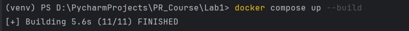

> Shows the Docker Compose build process in the terminal.

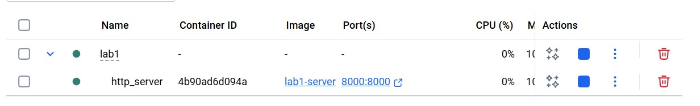

> Docker Desktop showing the built containers.

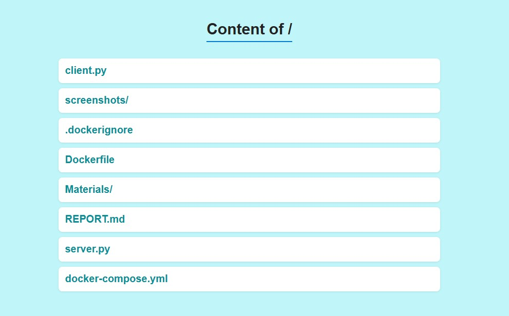

> Running server container.


### docker-compose.yml
The docker-compose.yml defines a service called server that is built from the Dockerfile in the current directory. The 
container is named http_server and runs the command python server.py /app/Materials 8000 to start the HTTP server 
serving files from /app/Materials on port 8000. The ports line maps container port 8000 to the host, allowing access 
via http://localhost:8000. The volumes line mounts the host ./Materials directory into the container so files are
available to the server, and restart: unless-stopped ensures the container restarts automatically unless stopped manually.

```yaml
services:
  server:
    build: .
    container_name: http_server
    command: [ "python", "server.py", "/app/Materials", "8000"]
    ports:
      - "8000:8000"
    volumes:
      - ./Materials:/app/Materials
    restart: unless-stopped

```

### Dockerfile
The Dockerfile starts from the lightweight python:3.11-slim image. It sets the working directory inside the container 
to /app and copies all files from the project directory on the host into /app in the container. Port 8000 is exposed so 
the HTTP server can be accessed from outside the container. Finally, the CMD instruction runs the server with python 
server.py /app/Materials 8000, which starts the HTTP server and serves files from the /app/Materials directory on 
port 8000.

```doctest
FROM python:3.11-slim

WORKDIR /app
COPY . /app
EXPOSE 8000

CMD ["python", "server.py", "/app/Materials", "8000"]
```

### Command that runs the server inside the container, with a directory as an argument
The following command tells Docker to start the container by running Python with the server.py script, passing /app/Materials as 
the directory to serve and 8000 as the port number. Essentially, it launches the HTTP file server inside the container
so that all files in the specified directory are accessible via a web browser or client.
```yaml
    command: [ "python", "server.py", "/app/Materials", "8000"]
```


## 3. Server Output
The server generates an HTML page that displays the contents of the specified directory, showing all files and 
subdirectories. Users can browse the directory and access supported file types, including PNG, PDF, and HTML files.

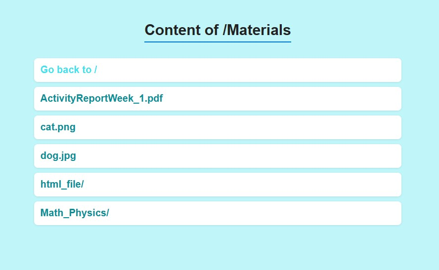

> Server generated HTML page showing the directory contents.


### Accessing different file formats


> Viewing an HTML file with embedded PNG images served correctly by the server.

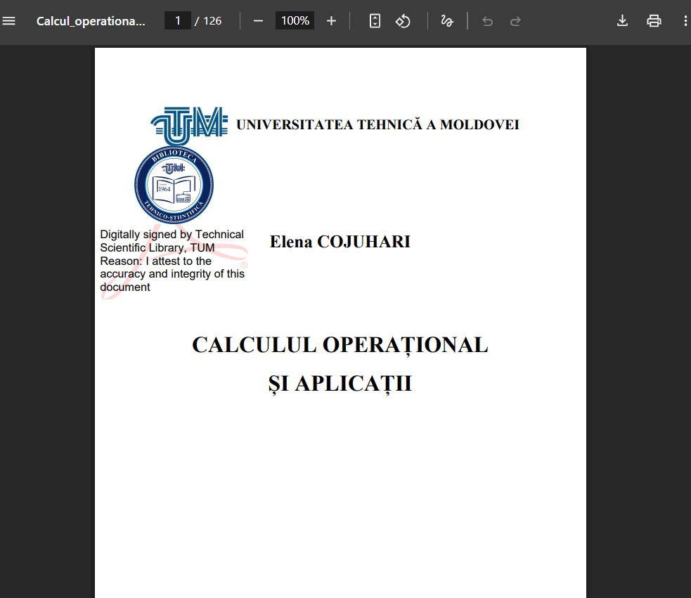

> Accessing a PDF file

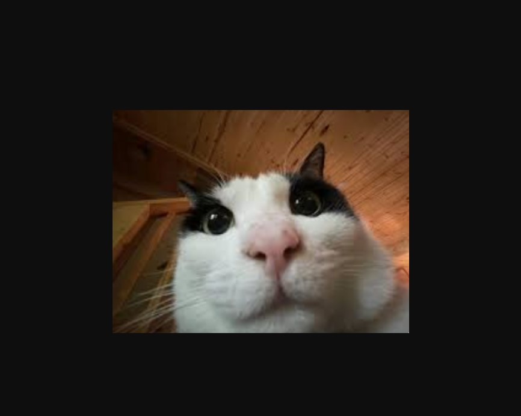

> Accessing a PNG image

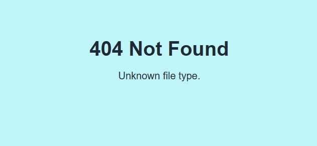

> Attempting to access an unsupported file type

## 4. Client Output
The client program allows requesting files from the server and handles them depending on their type. For HTML files, 
it prints the content directly in the terminal. For supported binary files such as PNG and PDF, it saves them into the 
specified local directory. If an unsupported file type is requested, the client prints an error message and does not
save the file.

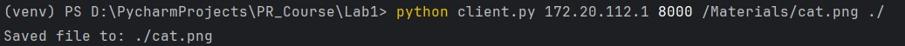

> Downloading a file using client.py 

## 5. Friend's Server Request

To test the client-server interaction across different computers, I connected to a friend’s server. Both computers
needed to be on the same Wi-Fi network, and firewall protections were temporarily disabled to allow TCP connections. 
By identifying the computer’s IP address, I was able to send HTTP requests to the server using my client program.

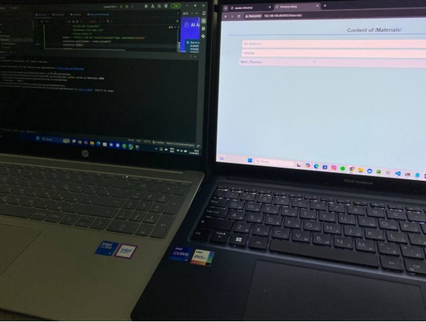


I connected to the server hosted by Janeta Grigoras (FAF-231) and successfully requested files. The client correctly 
handled the server responses, saving the downloaded file to the local directory.

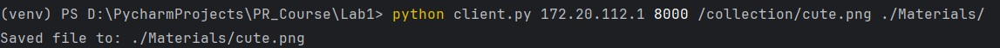

> Downloading a friend's file using client.py 

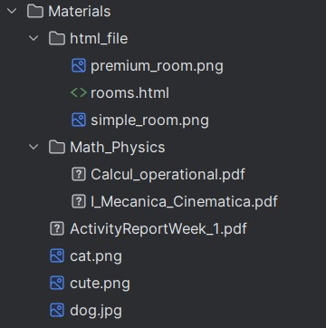

> The directory after the command execution


## Conclusion
In this laboratory work, I developed a simple HTTP file server using TCP sockets and a corresponding client capable of 
requesting and saving files. The server handles HTML, PNG, and PDF files while providing directory listings for 
browsing. Docker and Docker Compose were used to containerize the project, ensuring it can run consistently on any
machine. Testing included accessing local files, handling unknown file types, and connecting to a friend’s server over 
the network. This lab strengthened my understanding of network programming, TCP communication, HTTP protocols, and 
containerized deployment.
