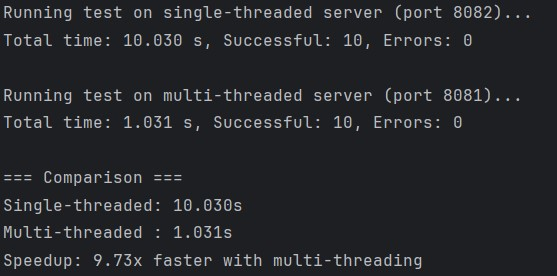
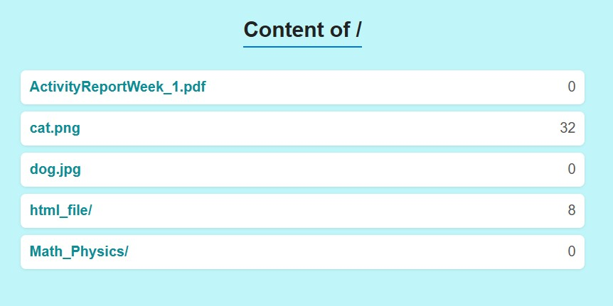
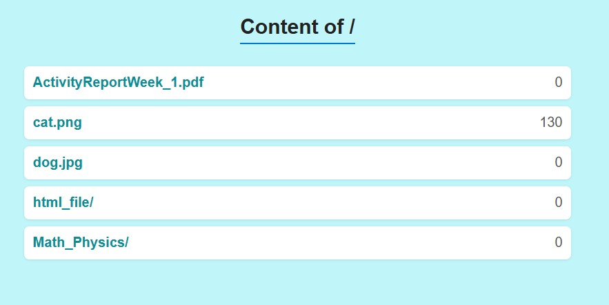
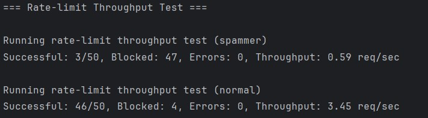

# Topic: Concurrent HTTP server

### Course: Network Programming
### Author: Daniela Cojocari

----
## 1. Multithreaded Server
In this laboratory, I modified my single-threaded server from Lab 1 so that it can handle multiple connections 
concurrently. I chose to implement it using a thread pool, which allows a fixed number of worker threads to process 
incoming requests from a shared queue. The benefits of this approach include better resource management, reduced 
overhead from creating and destroying threads for each connection, and improved server responsiveness under high load.

I am using workers in the following way:
```python
for i in range(N_WORKERS):
    t = threading.Thread(target=worker_loop, args=(conn_queue, SERVE_ROOT), daemon=True)
    t.start()
```
> Each worker continuously pulls a connection from the queue and processes it. Using a daemon thread ensures that all 
> threads terminate automatically when the main program exits.

## 2. Multiple Concurrent Requests Test
For this test, I implemented simultaneous requests to the server to measure its behavior under concurrent load. I also
added a time.sleep(1) in the server to simulate work being done for each request. The test involves requesting a file 
from the server directory multiple times in parallel.

The performance tests show that the multi-threaded server is significantly faster than the single-threaded one. While 
the single-threaded server took 10.030 seconds to handle 10 requests, the multi-threaded server completed the same 
requests in just 1.031 seconds. This demonstrates that concurrency greatly improves server throughput and responsiveness.



## 3. Counter Feature
The server records the number of requests made to each file and displays it in the directory listing.

I implemented two approaches:
1. Naive method – increments a counter without synchronization. This leads to race conditions, where some increments 
are lost because two threads may read the same value at the same time before either writes back. For example, in a test 
with 130 requests to cat.png, only 32 requests were successfully recorded, clearly demonstrating the incorrect behavior 
caused by concurrent access:


2. Synchronized method – increments the counter inside a lock to ensure thread safety. Using a threading.Lock() ensures 
that only one thread at a time can modify the counter for a file. This eliminates race conditions because each increment 
operation is atomic from the perspective of the threads. In the same test with 130 requests, all requests were correctly
counted, demonstrating that synchronization guarantees accurate results under concurrent load:



## 4. Rate Limiting
I implemented a per-IP rate limiter to prevent clients from exceeding a specified number of requests per second.
- Spammer test: the client exceeded the rate limit, resulting in most requests being blocked. Only a few requests 
succeeded, giving very low throughput. This confirms that the rate limiter effectively throttles abusive clients. 
- Normal test: the client sent requests just below the limit, so most requests succeeded, with only minor blocks due to 
timing overlaps. Throughput was significantly higher, showing that legitimate traffic is largely unaffected.

   


## 5. Friend Spam Test 

I also asked my friend Janeta Grigoras (FAF-231) to test the rate limiter via a browser. After clicking rapidly on a 
file, she was redirected to the 429 Too Many Requests page:


## Conclusion
In this lab, I successfully implemented a multithreaded HTTP server capable of handling concurrent connections. I 
demonstrated the importance of synchronization for shared counters and implemented a rate-limiting mechanism to protect 
the server from abusive clients.

Tests confirmed that the thread pool efficiently manages multiple simultaneous requests, the counter feature accurately 
records file accesses when properly synchronized and the rate limiting effectively blocks excessive requests while allowing
normal traffic.

Overall, this lab highlights key techniques for building robust, concurrent network servers in Python.
