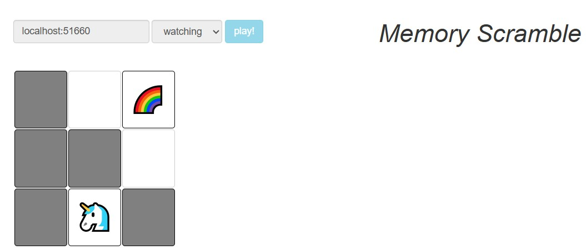
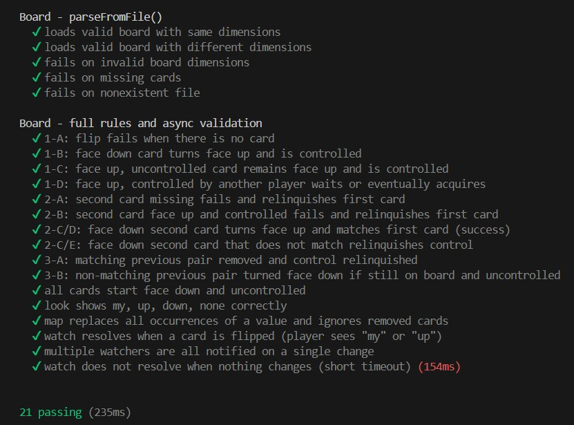
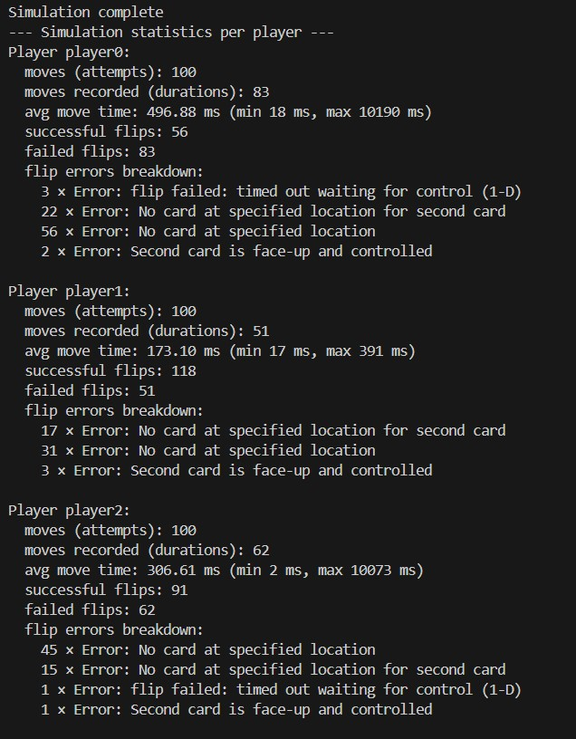
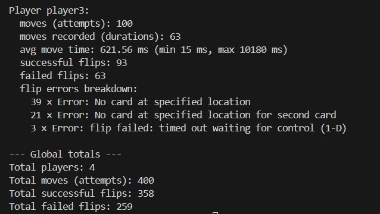

# Topic: Multiplayer Game

### Course: Network Programming
### Author: Daniela Cojocari

----
## 1. Game Overview

The project implements a multiplayer memory card game where multiple players can flip cards, attempt to find matching pairs, and compete for control of the board. The game enforces rules for card flipping, matching, and asynchronous interactions, ensuring a fair and consistent experience even with concurrent player actions.



### Card ADT

The Card ADT represents a single card on the game board. It stores the card’s value, whether it is currently face up, whether it has been removed from play, and which player (if any) currently controls it. The card’s position on the board is fixed using immutable row and column properties.

```
class Card {
    value: string;         // string printed on the card
    faceUp: boolean;       // whether the card is currently face up
    controller: string | null; // which player controls this card
    removed: boolean;      // whether the card is removed from the board
    readonly row: number;  // immutable row position
    readonly col: number;  // immutable column position

    constructor(value: string, row: number, col: number) {
        this.value = value;
        this.faceUp = false;
        this.controller = null;
        this.removed = false;
        this.row = row;
        this.col = col;
    }
}
```

### Player ADT

The Player ADT represents a game participant. It tracks the cards the player has selected in the current turn (firstCard and secondCard) as well as the cards controlled in the previous turn. The player has a unique immutable identifier to distinguish them from others.

```
class Player {
    readonly id: string;        // immutable player identifier
    firstCard: Card | null = null;  // first card controlled in current attempt
    secondCard: Card | null = null; // second card controlled
    previousFirstCard: Card | null = null; // previous turn's first card
    previousSecondCard: Card | null = null;// previous turn's second card

    constructor(id: string) { this.id = id; }
}
```

### Board ADT

The Board ADT represents the entire game board. It maintains a 2D grid of Card objects and a registry of all players. It is responsible for enforcing game rules, managing card states, and handling concurrent interactions between players to ensure a fair and consistent gameplay experience.

```
export class Board {
    private readonly grid: (Card | null)[][];  // 2D array of Card objects
    private readonly players: Map<string, Player> = new Map(); // player registry

    constructor(height: number, width: number, cards: string[][]) {
        this.grid = new Array(height);
        for (let r = 0; r < height; r++) {
            this.grid[r] = new Array(width);
            for (let c = 0; c < width; c++) {
                this.grid[r][c] = new Card(cards[r][c], r, c);
            }
        }
    }
```

## 2. Unit Tests

All unit tests for the Board class passed successfully, confirming the correctness and stability of the implementation. Key points include:
- parseFromFile() tests: Verified that boards of varying dimensions are loaded correctly and that errors are thrown for invalid files, missing cards, or incorrect board dimensions.
- Full rules tests: Checked all flipping rules (1-A through 3-B), including face-down/up card handling, controlled cards, matches, and non-matches.
- Asynchronous behavior: Confirmed correct functionality of look, map, and watch, including proper notifications to multiple watchers.

The test suite executed 21 tests in 235ms with no failures, demonstrating reliable and predictable board behavior.



## 3. Simulation

The simulation ran 400 moves across 4 players, with each player attempting 100 moves. Highlights of the results:

- Total flips: 358 successful flips and 259 failed flips.
- Player performance: Player 1 achieved the highest success rate with short average move times, while Players 0 and 3 experienced longer delays due to waiting for card control.
- Errors: Most failed flips resulted from attempts on already-removed or controlled cards, with occasional timeouts while waiting to acquire control.
- Insights: The main factors affecting player success were card contention and timing differences, illustrating the impact of concurrency in a multiplayer memory game.

Importantly, the game handled all 400 moves without crashing, confirming stability under concurrent actions.





## Conclusion
The multiplayer memory game runs reliably, handling hundreds of moves without crashes. Unit tests verified full compliance with game rules, including asynchronous interactions and proper handling of controlled or removed cards. Simulation results highlighted how timing and card contention affect player success.

This project also demonstrates the importance of Abstract Data Types (ADTs) like Board, Card, and Player for structuring game state. ADTs ensure correctness, modularity, and maintainability, allowing safe interactions between multiple players in a concurrent environment.